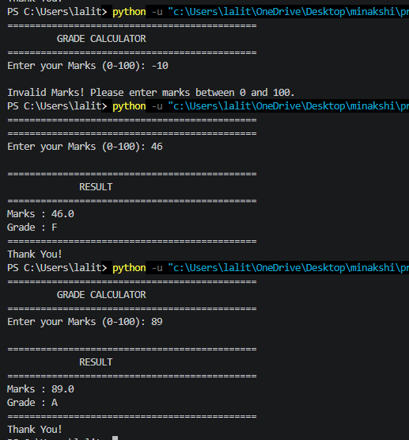

# Grade Calculator

A beginner-friendly Python project that calculates a student's grade based on the marks entered by the user.

## Features

- Accepts marks as input
- Validates input (0–100)
- Calculates grade using conditional statements
- Displays formatted output

## Technologies Used

- Python 3

## Project Structure

```
Day02_Grade_Calculator
│
├── grade_calculator.py
├── README.md
└── screenshot.png
```

## Grading Criteria

| Marks | Grade |
|-------:|:-----:|
| 90–100 | A+ |
| 80–89 | A |
| 70–79 | B |
| 60–69 | C |
| 50–59 | D |
| Below 50 | F |

## How to Run

```bash
python grade_calculator.py
```

## Screenshot



## Author

**Minakshi Sharma**
