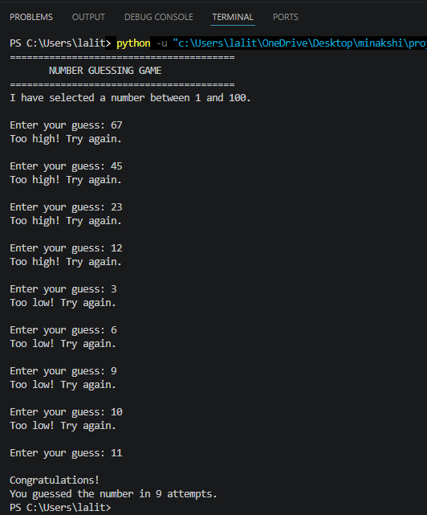

# 🎯 Day 03 – Number Guessing Game

A beginner-friendly Python mini project created as part of my **Python Bootcamp**. This project helps practice Python fundamentals such as loops, conditional statements, user input, and random number generation.

---

## 📚 Topics Covered

- `while` loop
- `break` statement
- `continue` statement
- Conditional statements (`if`, `elif`, `else`)
- User input
- Input validation
- Random number generation (`random` module)

---

## 📌 Project Description

The **Number Guessing Game** is a simple console-based Python game in which the computer randomly selects a number between **1 and 100**. The player must guess the correct number using the hints provided by the program.

- If the guess is too high, the program displays **"Too High!"**
- If the guess is too low, the program displays **"Too Low!"**
- The game continues until the correct number is guessed.
- At the end, the total number of attempts is displayed.

---

## ✨ Features

- 🎲 Random number generation
- 🎯 Interactive gameplay
- 📈 High/Low hints
- 🔄 Unlimited attempts
- 📊 Attempt counter
- 💻 Easy-to-use console interface

---

## 🛠️ Technologies Used

- Python 3
- Random Module

---

## 📂 Project Structure

```text
Day03_Number_Guessing_Game/
├── number_guessing_game.py
├── screenshot.png
└── README.md
```

---

## ▶️ How to Run

1. Clone the repository:

```bash
git clone https://github.com/minakshi3097sharma-cloud/Python_Bootcamp.git
```

2. Open the project folder:

```bash
cd Python_Bootcamp/Day03_Number_Guessing_Game
```

3. Run the program:

```bash
python number_guessing_game.py
```

---

## 🎮 Sample Output

```text
🎯 Welcome to the Number Guessing Game!

Guess a number between 1 and 100

Enter your guess: 45
Too Low!

Enter your guess: 78
Too High!

Enter your guess: 62

🎉 Congratulations!
You guessed the correct number.

Total Attempts: 3
```

---

## 📸 Screenshot

> Add your project screenshot here.



---

## 📖 Learning Outcomes

After completing this project, I learned how to:

- Use `while` loops effectively
- Apply conditional statements
- Accept user input
- Generate random numbers
- Build a simple interactive console application
- Improve problem-solving skills using Python

---

## 🚀 Future Improvements

- Add difficulty levels (Easy, Medium, Hard)
- Limit the number of attempts
- Add a score system
- Track the best score
- Allow multiple rounds
- Create a GUI version using Tkinter

---

## 👩‍💻 Author

**Minakshi Sharma**

- GitHub: https://github.com/minakshi3097sharma-cloud

---

⭐ **If you like this project, don't forget to star the repository!**
