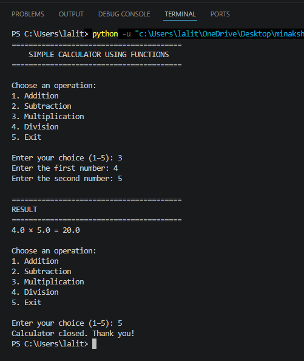

# Day 4 – Simple Calculator Using Functions

A beginner-friendly Python calculator created using functions.

## Features

- Addition
- Subtraction
- Multiplication
- Division
- Menu-driven program
- Input validation
- Division-by-zero handling
- Repeats until the user selects Exit

## Topics Used

- Functions
- Arguments
- Return values
- Conditional statements
- `while` loop
- `break`
- `continue`
- Exception handling

## Project Structure

```text
Day04_Functions/
├── simple_calculator.py
├── README.md
└── screenshot.png
```

## How to Run

```bash
python simple_calculator.py
```

## Screenshot



## Author

**Minakshi Sharma**
