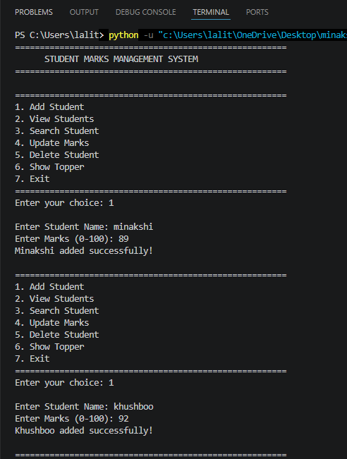

# 📚 Day 5 – Student Marks Management System

A beginner-friendly Python project to manage student marks using dictionaries, functions, loops, and conditional statements.

## 🚀 Features

- Add Student
- View All Students
- Search Student
- Update Marks
- Delete Student
- Display Topper
- Input Validation
- Menu-Driven Interface

## 🛠️ Concepts Used

- Lists
- Dictionaries
- Functions
- Loops
- Conditional Statements
- Exception Handling
- Input Validation

## 📂 Project Structure

```
Day05_Student_Marks_Management_System/
├── student_marks_management.py
├── README.md
└── screenshot.png
```

## ▶️ How to Run

```bash
python student_marks_management.py
```

## 📸 Screenshot



## 👩‍💻 Author

**Minakshi Sharma**
