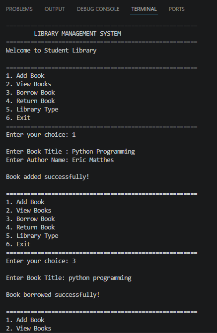

# 📚 Day 8 – Library Management System

A beginner-friendly Python project developed using **Object-Oriented Programming (OOP)** concepts.

---

## 🚀 Features

- ➕ Add Book
- 📖 View Books
- 📥 Borrow Book
- 📤 Return Book
- 🖥️ Menu-Driven Program
- 📚 Digital Library Example

---

## 🧠 OOP Concepts Used

- ✅ Class
- ✅ Object
- ✅ Constructor (`__init__`)
- ✅ Methods
- ✅ Inheritance
- ✅ Polymorphism
- ✅ Encapsulation (data stored inside objects)

---

## 📂 Project Structure

```
Day08_Library_Management_System/
│
├── library_management_system.py
├── README.md
└── screenshot.png
```

---

## ▶️ How to Run

```bash
python library_management_system.py
```

---

## 📸 Screenshot

```markdown

```

---

## 📚 Menu

```
1. Add Book
2. View Books
3. Borrow Book
4. Return Book
5. Library Type
6. Exit
```

---

## 💻 Technologies Used

- Python 3
- Object-Oriented Programming (OOP)

---

## 👩‍💻 Author

**Minakshi Sharma**

BCA Student | Python Developer | AI/ML & Data Science Learner
